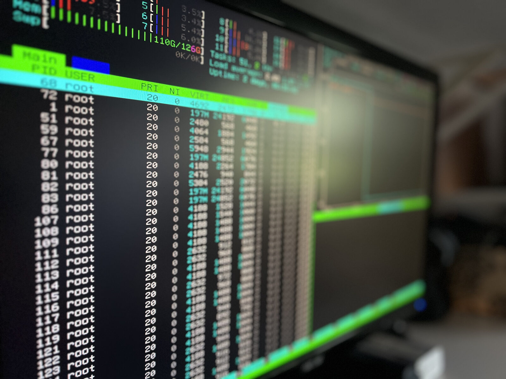

# BubbleScreen

A featherweight "screensaver" for TrueNAS Scale. Toggle it on and your server's
physical console becomes a live CPU / RAM / temperature / NVIDIA-GPU dashboard;
toggle it off and the normal TrueNAS console returns. Idle footprint: under
~50 MB RAM. No X, no desktop, no database.



## How it works

A slim Debian container runs `tmux` driving `htop` (CPU/RAM/temp) and `nvtop`
(NVIDIA GPU) on a free virtual terminal. GPU data comes from the host driver via
the NVIDIA container runtime. It replaces the console the same way steam-headless
does — minus the entire graphical desktop. (`htop` is used rather than `btop`
because it renders natively on a raw Linux console — no UTF-8 locale or wide
terminal required.)

## Install (TrueNAS Scale)

1. Apps → Discover Apps → Custom App (YAML).
2. Paste `compose.yaml`. It pulls the published image
   `ghcr.io/carmelosantana/bubblescreen:latest`.
3. Deploy. Turn the app **on** to take over the console; **off** to restore it.

The NVIDIA runtime must be enabled on the host (TrueNAS Apps → NVIDIA support).

## Modes

`APPS` picks *which* tools to show; `MODE` picks *how* they're arranged.

**`APPS`** (default `htop,nvtop`):
- `htop,nvtop` — both tools; `MODE` arranges them (below).
- `nvtop` — only the GPU monitor, full-screen. `MODE` is ignored.
- `htop` — only CPU/RAM/temp, full-screen. `MODE` is ignored.

**`MODE`** (only meaningful with two apps):

| MODE | Behavior |
|---|---|
| `smart` (default) | Overview normally; switches to the GPU view when GPU util is sustained above `GPU_THRESHOLD`, returns when it drops. Wakes the display on GPU activity. |
| `split` | htop (left) + nvtop (right), static. |
| `rotate` | Full-screen views cycling every `ROTATE_INTERVAL` seconds. |

## Configuration

| Var | Default | Meaning |
|---|---|---|
| `APPS` | `htop,nvtop` | which tools to show: `htop`, `nvtop`, or both |
| `MODE` | `smart` | `split` \| `rotate` \| `smart` (only applies with two apps) |
| `ROTATE_INTERVAL` | `20` | seconds per view (rotate) |
| `GPU_THRESHOLD` | `50` | GPU util % that triggers the GPU view |
| `GPU_THRESHOLD_HOLD` | `3` | seconds above threshold before switching |
| `GPU_HYSTERESIS` | `15` | % below threshold before returning |
| `SCREEN_TIMEOUT` | `300` | seconds of no keyboard/mouse input before the monitor sleeps (`0` = never) |
| `WAKE_ON_GPU` | `true` | a GPU spike wakes the monitor and shows the GPU view |
| `TARGET_VT` | `auto` | VT to use (`auto` picks a free one) |

### How the monitor sleeps and wakes

The Linux console runs on a firmware framebuffer (`efifb`) that can only paint
the screen black — it can't signal a monitor to actually power down, and a
constantly-redrawing dashboard would keep the kernel's own blank timer from ever
firing anyway. So BubbleScreen powers the monitor off the way a monitor's own
menu does: over **DDC/CI**, the control channel on the display cable, using
`ddcutil`. The NVIDIA GPU exposes those i2c buses.

- **Sleeps** after `SCREEN_TIMEOUT` seconds with no keyboard or mouse input.
  Idle is measured from real input events (`/dev/input`), not screen redraws.
- **Wakes** instantly on any keypress or mouse movement.
- **Wakes on a GPU spike** (when `WAKE_ON_GPU=true`): crossing `GPU_THRESHOLD`
  lights the screen and switches to the GPU view, then it sleeps again on the
  idle timer if you don't touch anything — so a long GPU job flashes up once and
  goes back to sleep rather than keeping the panel lit for hours.

**Requirements for power-off:** it's self-contained. The container loads
`i2c-dev` (via the bind-mounted `/lib/modules`) and creates the `/dev/i2c-*`
nodes itself from `/sys` — necessary because Docker gives a container a private,
point-in-time `/dev`, so the GPU's DDC buses (which can register after the
container starts, e.g. after a host reboot) otherwise never appear inside it.
The controller keeps retrying detection until the bus comes up, so it survives
reboots without intervention. The only thing you must do is **enable DDC/CI in
your monitor's on-screen menu** (some ship with it off). Monitors that don't
support DDC/CI power control are left on — BubbleScreen logs a clear line saying
so. Not every monitor honors DDC/CI; it's verified working on an ASUS VS247.

## Controls

Arrow keys switch views; mouse wheel scrolls. Any keyboard or mouse input wakes
the monitor and resets the idle timer; it sleeps again after `SCREEN_TIMEOUT`.

## Troubleshooting

- **Console not seized:** the app ships with `privileged: true` because seizing a
  VT needs the host's `/dev/tty*` nodes that `openvt` opens; a least-privilege cap
  set is not enough on TrueNAS. If the console still isn't grabbed, check the logs
  (`docker logs <container>`) — the entrypoint now prints a clear FATAL and **holds
  without restarting** rather than looping, so a misconfig won't spam the console.
- **Container restart-looping / `knvlinkCoreShutdownDeviceLinks` spam on the
  console:** that pattern means the entrypoint is exiting and being restarted, which
  re-inits/tears down the GPU each cycle. Read `docker logs` for the FATAL line; the
  common causes are a missing console tool or `openvt` unable to open a VT (needs
  `privileged`). This build holds instead of looping to prevent the spam.
- **No GPU data:** confirm the NVIDIA runtime is enabled and `nvidia-smi` works on
  the host; the container needs `NVIDIA_DRIVER_CAPABILITIES=utility`.
- **Wrong VT / console flicker:** pin `TARGET_VT` to a known free VT.
- **Display won't power off:** check the startup log (`docker logs <container>`).
  `DDC/CI display on /dev/i2c-N` means it's working. `no DDC/CI display yet —
  retrying` that never resolves means either the `/lib/modules` bind-mount is
  missing (so `i2c-dev` can't load), or the monitor's DDC/CI setting is off —
  enable it in the monitor's on-screen menu (often labelled "DDC/CI"). If the log
  shows a bus but the monitor still won't sleep, that monitor ignores the DDC/CI
  power command (VCP `D6`) and can't be slept over DDC.
- **Monitor goes fully dark with no standby LED:** that's normal, not a dead
  display. Some monitors treat the DDC "off" command (`D6=04`) as a deeper power
  state than a typical amber-LED standby, so the panel and its standby light both
  go dark. It still wakes on the next keypress, mouse move, or GPU spike (`D6=01`)
  — deeper off just means more power saved.
- **Garbled box-drawing characters on the console:** the tools must render with
  ACS line-drawing, not UTF-8. This image sets no locale on purpose; do not force
  a UTF-8 `LANG`/`LC_ALL`, or a raw VT console will show `âöç…` garbage.

## Development

```bash
sudo apt-get install -y bats tmux
bats tests/            # run all unit tests
docker build -t bubblescreen:test .
bash scripts/screenshots.sh   # regenerate README images (needs freeze + NVIDIA)
```

## License

[MIT](LICENSE) © Carmelo Santana
